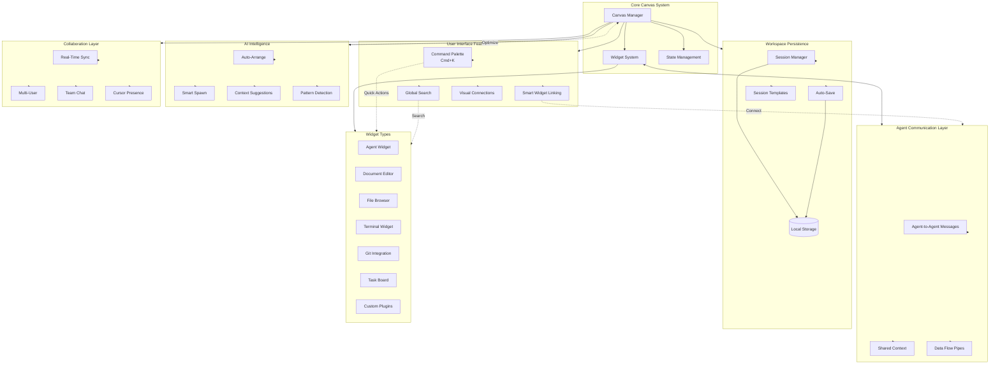

10 Feature Suggestions:

  1. Agent-to-Agent Communication

  - Enable widgets to send messages to each other
  - Visual connection lines showing data flow
  - Shared context between agents working on related tasks
  - Example: Frontend agent asks backend agent about API endpoints

  2. Workspace Sessions & Persistence

  - Save/load canvas layouts as named sessions
  - Auto-save widget positions and content
  - Session templates (e.g., "Full-Stack Dev", "Code Review")
  - Restore previous sessions on app restart

  3. Smart Widget Linking

  - Drag connections between widgets to establish relationships
  - Automatic dependency detection (e.g., file browser → editor)
  - Data pipelines (output of one widget feeds into another)
  - Visual graph showing widget dependencies

  4. Global Search & Command Palette

  - Cmd+K to open command palette
  - Search across all widgets, files, and content
  - Quick actions (spawn widget, arrange, zoom to widget)
  - Recent commands and frequently used actions

  5. Terminal Widget

  - Embedded terminal for running commands
  - Multiple terminal instances
  - Directory-aware (sync with file browser path)
  - Command history and suggestions

  6. Git Integration Widget

  - Visual git status, diff viewer
  - Commit, push, pull from canvas
  - Branch visualization
  - Integration with document editors for staging changes

  7. Task Board & Todo Widget

  - Kanban board for tracking development tasks
  - Drag tasks to agent widgets to assign work
  - Progress tracking across multiple agents
  - Integration with GitHub issues

  8. Plugin System

  - Custom widget types via JavaScript/TypeScript
  - Widget marketplace or registry
  - Third-party integrations (Jira, Slack, databases)
  - Custom themes and layouts

  9. AI-Powered Canvas Intelligence

  - Auto-suggest widget arrangements based on task
  - Smart spawn (AI decides which widgets you need)
  - Context-aware recommendations
  - Pattern detection (recognize common workflows)

  10. Real-Time Collaboration

  - Multiple users on same canvas
  - Cursor presence and live updates
  - Shared agent control or handoff
  - Built-in chat for team coordination

---

## Feature Architecture Diagram



## Command Palette Actions

| Command | Shortcut | Description |
|---------|----------|-------------|
| **Widget Management** |
| `Spawn Agent` | `Cmd+Shift+A` | Create new agent widget |
| `Spawn Document` | `Cmd+Shift+D` | Create new document editor |
| `Spawn File Browser` | `Cmd+Shift+F` | Create new file browser |
| `Spawn Terminal` | `Cmd+Shift+T` | Create new terminal widget |
| `Spawn Git Widget` | `Cmd+Shift+G` | Create new git integration |
| `Spawn Task Board` | `Cmd+Shift+K` | Create new kanban board |
| **Layout Management** |
| `Save Session` | `Cmd+S` | Save current canvas layout |
| `Load Session` | `Cmd+O` | Load saved session |
| `Auto-Arrange` | `Cmd+Shift+L` | AI-powered layout optimization |
| `Tile Horizontal` | - | Arrange widgets horizontally |
| `Tile Vertical` | - | Arrange widgets vertically |
| `Cascade Windows` | - | Cascade widget arrangement |
| **Navigation** |
| `Command Palette` | `Cmd+K` | Open command palette |
| `Global Search` | `Cmd+P` | Search across all content |
| `Zoom to Widget` | - | Focus on specific widget |
| `Next Widget` | `Cmd+Tab` | Switch to next widget |
| `Previous Widget` | `Cmd+Shift+Tab` | Switch to previous widget |
| **Communication** |
| `Link Widgets` | - | Create connection between widgets |
| `Send Message` | - | Send message to another agent |
| `View Data Flow` | - | Visualize widget connections |
| `Broadcast to All` | - | Send message to all agents |
| **Session** |
| `New Session` | `Cmd+N` | Start fresh canvas session |
| `Session Templates` | - | Load from predefined templates |
| `Export Session` | - | Export session configuration |
| `Import Session` | - | Import session from file |

## Widget Interaction Flow

```
┌─────────────────────────────────────────────────────────────────┐
│                        Command Palette                          │
│                          (Cmd+K)                                │
└────────────────────┬────────────────────────────────────────────┘
                     │
        ┌────────────┴────────────┐
        │   User Action/Command   │
        └────────────┬────────────┘
                     │
    ┌────────────────┼────────────────┐
    │                │                │
    ▼                ▼                ▼
┌────────┐      ┌────────┐      ┌─────────┐
│ Spawn  │      │ Link   │      │  AI     │
│ Widget │      │ Widget │      │ Suggest │
└───┬────┘      └───┬────┘      └────┬────┘
    │               │                 │
    ▼               ▼                 ▼
┌─────────────────────────────────────────┐
│            Canvas Manager               │
│  ┌──────┐  ┌──────┐  ┌──────┐         │
│  │Agent │◄─┤ Link ├─►│Agent │         │
│  │  1   │  └──────┘  │  2   │         │
│  └──┬───┘            └───┬──┘         │
│     │                    │             │
│     └────────┬───────────┘             │
│              ▼                          │
│      ┌──────────────┐                  │
│      │Shared Context│                  │
│      └──────────────┘                  │
└─────────────────────────────────────────┘
```

## Priority Implementation Roadmap

### Phase 1: Foundation (MVP+)
- ✅ Basic widget system
- ✅ Canvas management
- ⏳ Command Palette (Cmd+K)
- ⏳ Session Save/Load

### Phase 2: Communication
- 🔲 Agent-to-Agent messaging
- 🔲 Widget linking UI
- 🔲 Shared context store
- 🔲 Visual connection lines

### Phase 3: Essential Widgets
- 🔲 Terminal widget
- 🔲 Git integration widget
- 🔲 Enhanced file browser

### Phase 4: Intelligence
- 🔲 Auto-arrange layouts
- 🔲 Smart widget suggestions
- 🔲 Context-aware actions

### Phase 5: Advanced Features
- 🔲 Task board widget
- 🔲 Plugin system
- 🔲 Real-time collaboration

Legend: ✅ Complete | ⏳ In Progress | 🔲 Planned
